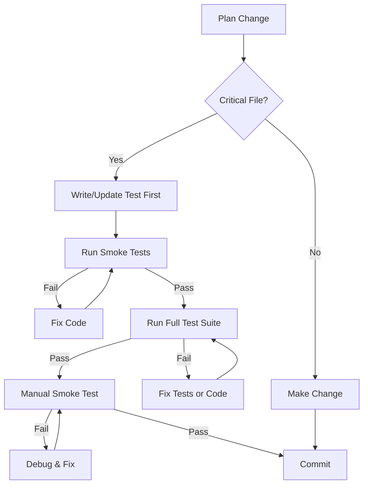

# Regression Prevention Strategy
**Date:** 2025-12-13
**Purpose:** Prevent breaking what's currently working while moving forward
**Problem:** Constant cycle of fixing and re-breaking functionality

---

## Executive Summary

**Current Situation:**
- ✅ 238 tests passing, 71 failing (77% pass rate)
- ✅ MetaSteel demo smoke test checklist exists and defines working state
- ⚠️ No automated smoke tests - all manual verification
- ⚠️ Test failures ignored (not blocking development)
- ⚠️ No pre-commit hooks or CI/CD to catch regressions

**Goal:** Lock down what's working so new development doesn't break it.

**Strategy:** 3-tier defense system:
1. **Smoke Tests** (automated critical paths) - MUST PASS before any commit
2. **Regression Test Suite** (expanded unit/integration tests) - MUST PASS in CI
3. **Change Control Process** (pre-flight checklist before changes)

---

## Tier 1: Automated Smoke Tests (CRITICAL)

### What Are Smoke Tests?
Smoke tests verify the **absolute minimum** functionality needed for the system to work. If smoke tests fail, the system is broken.

### SmartMetal Critical Flows (Must Work Always)

Based on [METASTEEL_SMOKE_TEST_CHECKLIST.md](docs/METASTEEL_SMOKE_TEST_CHECKLIST.md), these are the **6 critical flows**:

#### 1. Dashboard Load
```
✅ MUST WORK: User can log in and see dashboard with summary cards
❌ BREAKS IF: Auth middleware broken, tenant resolution fails, dashboard query breaks
```

#### 2. RFQ List & Detail
```
✅ MUST WORK: User can view RFQ list and open RFQ details
❌ BREAKS IF: RFQ queries broken, tenant filtering breaks, RFQ detail route fails
```

#### 3. Pricing Runs View
```
✅ MUST WORK: User can view pricing runs linked to RFQs
❌ BREAKS IF: Pricing service breaks, pricing_runs queries fail, joins break
```

#### 4. Approvals Queue
```
✅ MUST WORK: User can view approvals and see approval status
❌ BREAKS IF: Approval queries break, status enums change, approval routes fail
```

#### 5. Materials Catalog
```
✅ MUST WORK: User can view materials, no duplicates, tenant-scoped correctly
❌ BREAKS IF: Materials queries break, tenant_id filtering fails, migration 058 reverted
```

#### 6. Price Agreements
```
✅ MUST WORK: User can view price agreements for their tenant
❌ BREAKS IF: Agreement queries break, tenant isolation fails, RLS breaks
```

### Implementation: Automated Smoke Test Suite

**File:** `backend/src/__tests__/smoke/critical-flows.test.js`

**Run:** `npm run test:smoke` (before every commit)

**What It Tests:**
- ✅ All 6 critical API endpoints return 200
- ✅ All 6 queries return expected data shape
- ✅ No cross-tenant data leakage
- ✅ No duplicate materials per tenant
- ✅ All foreign keys intact

**Time to Run:** < 30 seconds

**RULE:** If smoke tests fail, **STOP** - do not commit, do not push, do not merge.

---

## Tier 2: Regression Test Suite (IMPORTANT)

### Current Test Status

```
Test Suites: 11 failed, 7 passed, 18 total
Tests:       71 failed, 238 passed, 309 total
```

**Problem:** 71 failing tests are ignored - some may indicate real regressions.

### Action Plan

#### Phase 1: Triage Failing Tests (2-4 hours)
1. Run `npm test` and capture all failures
2. For each failure, classify:
   - **Real Bug** - Test is correct, code is broken (FIX CODE)
   - **Outdated Test** - Test expects old behavior (UPDATE TEST)
   - **Flaky Test** - Test fails intermittently (FIX TEST or SKIP)
   - **Obsolete Test** - Test for removed feature (DELETE TEST)

#### Phase 2: Fix or Skip Blocking Tests (4-6 hours)
- Fix all "Real Bug" failures
- Update all "Outdated Test" failures
- Skip flaky tests with `.skip()` and add TODO comments
- Delete obsolete tests

**Goal:** Get to **0 failing tests** (or all failures explicitly skipped with reasons)

#### Phase 3: Add Missing Coverage (ongoing)
**High Priority Areas (currently <10% coverage):**
- `materialsService.js` (2.85% coverage)
- `pricingService.js` (2.53% coverage)
- `rfqService.js` (2.84% coverage)
- `learningService.js` (3.1% coverage)

**Don't test everything** - focus on critical paths:
- Materials CRUD with tenant isolation
- RFQ create/read/update
- Pricing run create/read
- Approval status transitions

---

## Tier 3: Change Control Process (DISCIPLINE)

### Pre-Flight Checklist (Before ANY Code Change)

Before modifying any critical file, ask:

```
1. What am I changing?
2. What features depend on this?
3. What tests cover this?
4. What could break if I'm wrong?
5. How will I verify it still works?
```

### Critical Files (High Risk of Breaking Things)

**Database Migrations:**
- ⚠️ `backend/src/db/migrations/*.js` - Can break schema, lose data
- **Safeguard:** ALWAYS test migration up/down on dev DB before prod
- **Verification:** Run `npm run verify:metasteel:health` after migration

**Core Services (High Dependency):**
- ⚠️ `backend/src/services/materialsService.js` - Materials CRUD
- ⚠️ `backend/src/services/pricingService.js` - Pricing engine
- ⚠️ `backend/src/services/rfqService.js` - RFQ management
- ⚠️ `backend/src/services/approvalService.js` - Approval workflow
- **Safeguard:** Run smoke tests before/after changes
- **Verification:** Run full test suite `npm test`

**Middleware (Affects All Requests):**
- ⚠️ `backend/src/middleware/tenant.js` - Tenant resolution
- ⚠️ `backend/src/middleware/auth.js` - Authentication
- ⚠️ `backend/src/middleware/errorHandler.js` - Error handling
- **Safeguard:** Test with multiple tenants (NSC + MetaSteel)
- **Verification:** Run `npm run test:metasteel-api`

**Database Client:**
- ⚠️ `backend/src/db/supabaseClient.js` - DB connection
- ⚠️ `backend/src/db/tenantContext.js` - Tenant context
- **Safeguard:** NEVER change without full test suite passing
- **Verification:** Run all integration tests

### Change Workflow (Step-by-Step)



**In Practice:**
1. **Before coding:** Run `npm run test:smoke` - capture baseline
2. **Write test first:** If changing critical file, add/update test
3. **Make change:** Implement your feature/fix
4. **After coding:** Run `npm run test:smoke` - verify no regressions
5. **Before commit:** Run `npm test` - verify all tests still pass
6. **Before push:** Run manual smoke test (5 min MetaSteel checklist)

---

## Quick Reference: Protection Tools

### Pre-Commit Hooks (RECOMMENDED)

Install Husky to automatically run smoke tests before every commit:

```bash
# Install Husky
npm install --save-dev husky

# Enable Git hooks
npx husky install

# Add pre-commit hook
npx husky add .husky/pre-commit "cd backend && npm run test:smoke"
```

**Effect:** Git will refuse to commit if smoke tests fail.

### npm Scripts to Add

Add these to `backend/package.json`:

```json
{
  "scripts": {
    "test:smoke": "jest --testPathPattern=smoke --coverage=false",
    "test:regression": "jest --coverage",
    "test:critical": "jest --testPathPattern='(smoke|integration)' --coverage=false",
    "verify:all": "npm run test:smoke && npm run verify:metasteel:health && npm run test:metasteel-api",
    "safe-migrate": "npm run db:backup:auto && npm run migrate && npm run verify:all"
  }
}
```

### Git Aliases (OPTIONAL)

Add to `~/.gitconfig`:

```ini
[alias]
    safe-commit = "!f() { cd backend && npm run test:smoke && cd .. && git commit \"$@\"; }; f"
    safe-push = "!f() { cd backend && npm run verify:all && cd .. && git push \"$@\"; }; f"
```

**Usage:**
```bash
git safe-commit -m "Add feature X"  # Runs smoke tests before commit
git safe-push origin main           # Runs full verification before push
```

---

## What To Do Right Now (Priority Order)

### 🔴 IMMEDIATE (Do This First - 1 hour)

#### 1. Create Smoke Test Suite
**File:** `backend/src/__tests__/smoke/critical-flows.test.js`

**Content:** Test all 6 critical flows with actual API calls

**Script:** Add `test:smoke` to package.json

**Verify:** Run `npm run test:smoke` - should pass with fresh MetaSteel data

#### 2. Baseline Current Working State
**Command:**
```bash
cd backend
npm run reset:metasteel
npm run verify:metasteel:health
npm run test:metasteel-api
```

**Document:** Capture output - this is your "known good state"

**Location:** Save output to `docs/BASELINE_STATE_2025-12-13.md`

---

### 🟡 HIGH PRIORITY (Do This Next - 4 hours)

#### 3. Fix Critical Test Failures
**Focus:** Only tests that indicate real bugs

**Files to check:**
- `src/utils/fuzzyMatch.test.js` - 3 failures (may be threshold issues)
- Any integration test failures

**Goal:** Get to 0 real failures (skipping flaky/obsolete tests is OK)

#### 4. Add Test Coverage for Materials Service
**Why:** Materials is newly tenant-scoped (Phase B.3) - high regression risk

**File:** `backend/src/services/__tests__/materials.test.js` (create new)

**Tests to add:**
- Create material with tenant_id
- Update material (tenant-scoped)
- Delete material (tenant-scoped)
- Verify no cross-tenant access
- Verify material_code uniqueness per tenant

**Time:** 2-3 hours

---

### 🟢 MEDIUM PRIORITY (Do Later - ongoing)

#### 5. Install Pre-Commit Hooks
**Tool:** Husky

**Effect:** Auto-run smoke tests before every commit

**Time:** 30 minutes

#### 6. Document "Known Breaking Changes"
**File:** `docs/BREAKING_CHANGES.md`

**Content:** List of changes that are KNOWN to break things:
- "Reverting migration 058 breaks materials tenant isolation"
- "Changing tenant middleware breaks all routes"
- "Removing outcome columns breaks analytics"

**Purpose:** Warn future developers what NOT to do

---

## Maintenance Workflow Going Forward

### Before Starting New Feature
1. Run `npm run verify:all` - confirm system healthy
2. Run `npm run reset:metasteel` - get clean demo data
3. Walk through smoke test checklist manually (5 min)
4. Document baseline state

### During Development
1. Write tests FIRST for critical changes
2. Run `npm run test:smoke` frequently (every 30 min)
3. Commit small, working changes (don't batch)

### Before Committing
1. Run `npm run test:smoke` - MUST PASS
2. Run `npm test` - fix any NEW failures
3. Run manual spot-check of affected features

### Before Pushing
1. Run `npm run verify:all` - comprehensive check
2. Verify MetaSteel demo still works (login + dashboard)

### After Merging to Main
1. Re-run full verification on main branch
2. Update baseline state documentation
3. Tag release if significant milestone

---

## Common Pitfalls & How to Avoid Them

### ❌ Pitfall 1: "I'll write tests later"
**Result:** You forget, tests never get written, regressions creep in

**Solution:** Write test FIRST (TDD) or immediately after (within same commit)

### ❌ Pitfall 2: "Tests are failing but it's probably fine"
**Result:** Real regressions hidden among flaky tests

**Solution:** Keep test suite at 100% pass (skip flaky tests explicitly)

### ❌ Pitfall 3: "This change is too small to need testing"
**Result:** Small change breaks dependency you didn't know existed

**Solution:** Always run smoke tests - they're fast (<30s)

### ❌ Pitfall 4: "I tested it manually, that's good enough"
**Result:** Manual test only covers happy path, edge cases break

**Solution:** Automated tests catch edge cases you forgot to test manually

### ❌ Pitfall 5: "I'll fix the tests after I finish the feature"
**Result:** Feature is done but tests are broken, technical debt grows

**Solution:** Tests are PART OF the feature - not done until tests pass

---

## Success Metrics

### How to Know This Strategy Is Working

**Week 1:**
- ✅ Smoke test suite exists and runs in <30s
- ✅ Baseline state documented
- ✅ All critical test failures triaged

**Week 2:**
- ✅ 0 test failures (or all explicitly skipped with reasons)
- ✅ Pre-commit hooks installed and enforced
- ✅ No regressions introduced (smoke tests catch them)

**Month 1:**
- ✅ Test coverage >50% on critical services
- ✅ Zero "I broke it again" incidents
- ✅ Confidence to refactor without fear

**Long-term:**
- ✅ New features include tests by default
- ✅ Regressions caught in seconds, not days
- ✅ Development speed increases (less time debugging)

---

## Summary: The Core Principle

**ONE RULE TO RULE THEM ALL:**

> **Never commit code that breaks the smoke tests.**

That's it. Follow this one rule and you'll prevent 90% of regressions.

Everything else in this document is just automation and discipline to enforce that rule.

---

## Next Steps

1. **Read this document** ✅ (you're doing it now)
2. **Create smoke test suite** (1 hour)
3. **Establish baseline** (30 min)
4. **Install pre-commit hooks** (30 min)
5. **Start using change workflow** (ongoing)

**Total time investment:** ~2 hours upfront
**Time saved per week:** 4-8 hours (no more fix/break cycles)
**ROI:** 200-400% in first month

---

## Questions & Troubleshooting

### Q: What if smoke tests fail after someone else's commit?
**A:** Revert the commit immediately, notify the developer, ask them to fix and re-commit with passing tests.

### Q: What if I need to make a change that intentionally breaks smoke tests?
**A:** Update the smoke tests FIRST (in same commit), document the breaking change, get team approval.

### Q: What if smoke tests are too slow (>1 min)?
**A:** Optimize them - use test DB with minimal data, mock external services, parallelize tests.

### Q: What if I'm in a rush and tests are slowing me down?
**A:** Tests save time in the long run. A 30-second test now prevents 2 hours of debugging later.

---

**Document Owner:** Development Team
**Last Updated:** 2025-12-13
**Next Review:** 2025-12-20 (1 week after implementation)
